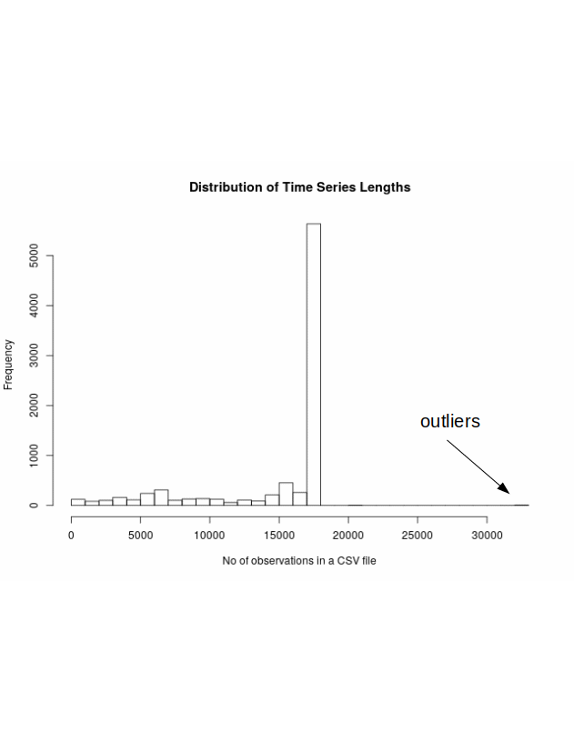
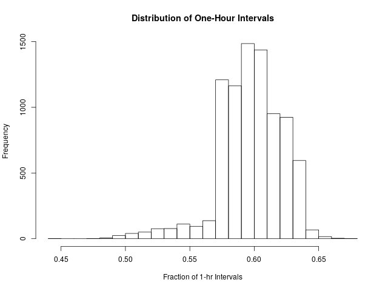
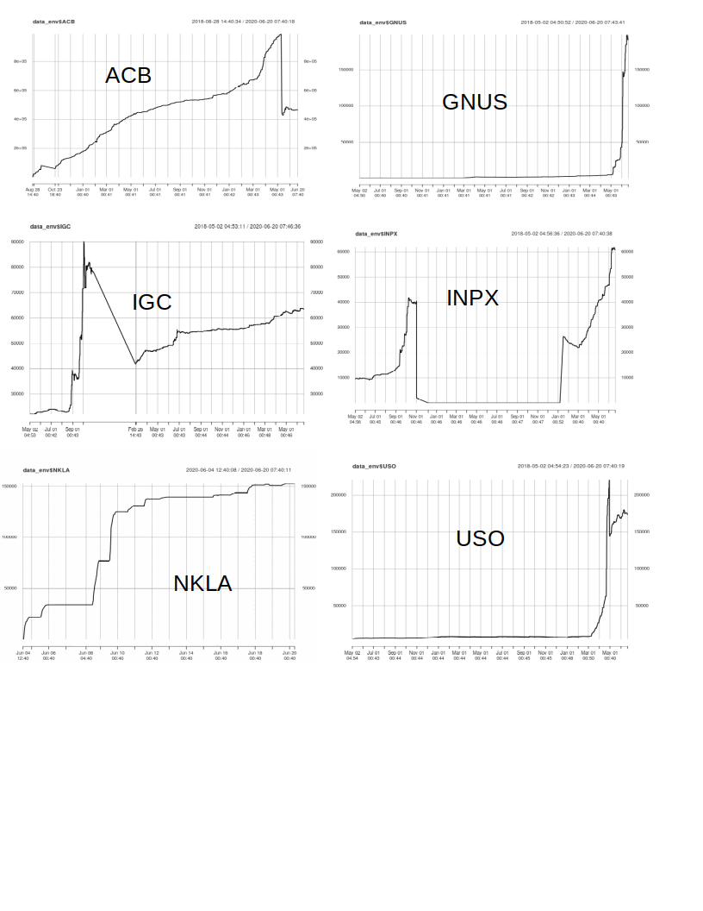

# Exploring the *robintrack* data [Jun 20, 2020]

As of Jun 20, the robintrack data comes in a total of 8,467 csv files, each file corresponds to one stock.

### Time Series Length

Most of the time series started in May 2018, so they have a little over two years of history. Below shows the distribution of the lengths of the time series. 

 

This is how I interpret this graph, called a histogram by the statistics folks. The peak location tells you majority of the files have length of roughly 18000, i.e. each file has that many rows. There are many files, or stocks, with fewer than 18000. For example, judging by the size of the bars, there are roughly a thousand files with length between 5000 and 10000 rows. And also there are a few outliers with far more data points than others, marked on the far right:
`EBR.csv GEF.csv HEI.csv HVT.csv LEN.csv MKC.csv PBR.csv STZ.csv WSO.csv`

They are a bit unusual and worth further investigation.

### Size of Time Steps
Most of the data are spaced by one hour, i.e. *robintrack* takes a snapshot of the popularity data from Robinhood every 60 minutes. However, it seems to vary from ticker to ticker. Below shows the distribution of percent of 1-hour intervals.

 

### Stocks with no user interest
Some stocks have attracted little interest from the Robinhood community. There is a total of 330 tickers with close to zero user holding over the two year period. Below is a random sample of 10 of them.
`"DWMF" "ELON" "PBSM" "QXMI" "VIIZ" "OQAL" "VXX"  "INPX" "REIS" "XMHQ"`

### Abrupt changes in user holding
Here I show the stocks with some abrupt changes in the user holdings. There are 5 of them.

`"ACB"  "GNUS" "IGC"  "INPX" "NKLA" "USO"`

 

## Scripts
The script for the above exercises is `data_exploration.R` which needs the functions in `Fun.R` under `utils`.

### Contact
To ask questions or report issues, please open an issue on the [issues tracker](https://github.com/htso/Robinhood_at_a_glance/issues).

References

[1] https://robintrack.net

-----

The information in this repository is provided for information purposes only. It is not intended to be and does not
constitute financial advice or any other advice, is general in nature and not specific to you. Before using this
information to make an investment decision, you should seek the advice of a qualified and registered securities
professional and undertake your own due diligence. None of the information here is intended as investment advice,
as an offer or solicitation of an offer to buy or sell, or as a recommendation, endorsement, or sponsorship of any
security, Company, or fund. I am not responsible for any investment decision made by you. You are responsible for
your own investment research and investment decisions.

