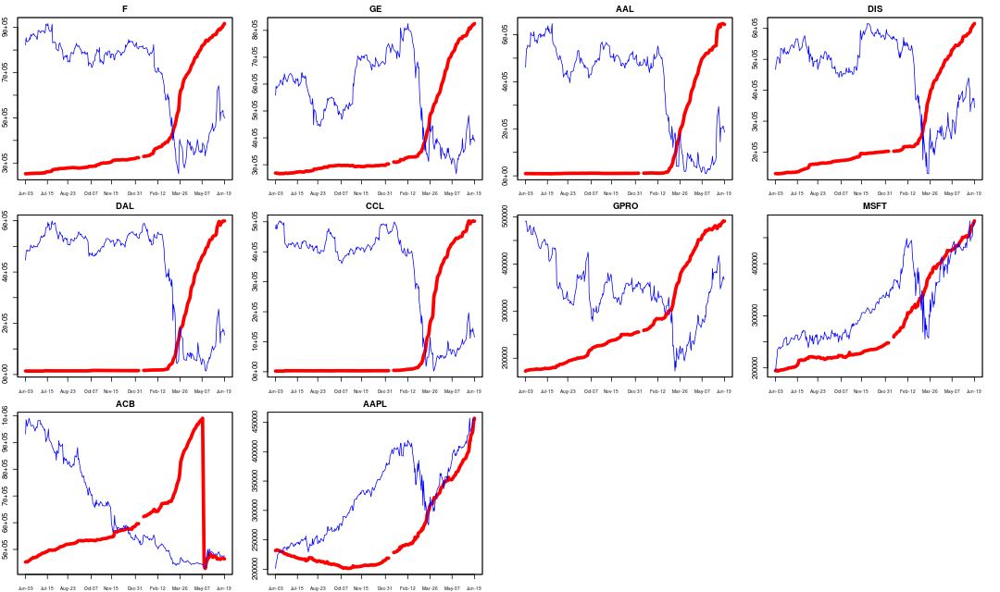
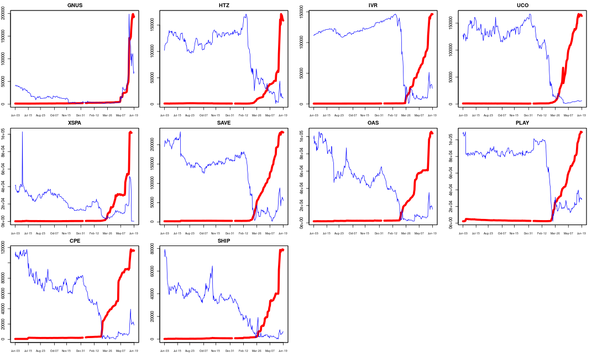

# Robinhood at a Glance

This is a preamble to full scale modeling the Robinhood popularity data using machine learning. Before I do that, I want to 
take a glance of the current market as seen in the Robinhood community. Here I use the dataset provided in [*robintrack*](https://robintrack.net), 
which has user holdings up till Jun 20, 2020. 

[Robinhood](https://robinhood.com) is a discount broker which charges zero commission for stock trading. It has gained almost a cult following in
recent years, particularly among the millennials. Unlike other brokers, it publishes aggregate data about what stocks its
users own, and that is the *popularity data* I analyse here. 

For example, in the table below, it shows there are 904,254 stock accounts in Robinhood 
that owns shares in Ford. However, Robinhood does not publish the exact number of shares each account holds. 

Since the dataset is sizeable and it belongs to *robintrack*, I do not include it in this repo. 
To run my scripts, you need to download it from his site -- see __Data Sources__ below.

## Top 10 Holdings
These are the favorites of the Robinhood community. Interestingly, seven of the 10 happen to be old fashion non-technology names. 

| Ticker    |  Company Name   | Mar 20 Holdings | Current Holdings | Change % |
| -----------|--------|---------|---------|------|
|    F  |  Ford | 303,352  |  904,254 |  198  |
|   GE  |  General Electric |291,234  |  817,346 | 180  |
|     AAL |  American Airline  |61,748  |  643,567 | 942 |
|  DIS  | Disney |167,922  |  605,648 | 260  |
|  DAL  |   Delta Airline | 62,161  |  594,703 | 856 |
|  CCL  |  Carnival | 49,300  |  500,496 | 915 |
| GPRO  | GoPro |208,416  |  487,691 | 134|
| MSFT  |  Microsoft |219,815  |  474,344 | 115 |
|    ACB  | Aurora Cannabis |461,893  |  465,437 | 0.7|
|   AAPL  |  Apple |224,299  |  438,283 | 95 |

Below I plot the popularity over time against the price during since Jun 2019. 

Red line : Robinhood's popularity, or user holding. Blue line : stock price.

## Stocks held by at least 100k accounts
Just a quick scan of the most popular holdings. Notice that some of these are ETF, e.g. `VOO`, `SPY`. 

`"F"    "GE"   "AAL"  "DIS"  "DAL"  "CCL"  "GPRO" "MSFT" "ACB"  "AAPL" "NCLH" "UAL"  "BA"   "BAC"  "FIT"
"PLUG" "SNAP" "TSLA" "HEXO" "CGC"  "AMZN" "RCL"  "SAVE" "UBER" "INO"  "CRON" "TWTR" "AMD"  "BABA" "FB" "GRPN" "MRNA" "ZNGA"
"MGM"  "MRO"  "SBUX" "LUV"  "APHA" "KO"   "JBLU" "T"    "GNUS" "TOPS" "MFA"  "USO" "OGI"  "XOM"  "UCO"  "HTZ"  "NIO"  "NKLA" "IVR"  "LK"   "NFLX" "GM"   "AMC"  "SPCE" "NOK"  "CPE"  "VOO" "CTST" "NRZ"  "NVDA" "PENN" "PLAY" "TLRY" "CPRX" "DKNG" "OAS"  "SIRI" "WORK" "SPY"` 

## Largest % increase since Mar 20
Holdings in these stocks have gone up mutiple times. I use March 20 as the base level for comparison since that's the bottom of this bear market -- so far. 

    
| Ticker    |  Company Name   | Mar 20 Holdings | Current Holdings | Change % |
| -----------|--------|---------|---------|------|
| GNUS   | Genius Brands |  6,140 |   190,193  | 2,997 |
|  HTZ   | Hertz|  7,126 |   163,226|  2,190|
|  IVR   | Invesco Mortgage|  7,974  |  144,370 |  1,710|
|  UCO  |ProShares Ultra Crude Oil|  11,363  |  164,385 |  1,346|
| XSPA  |XpresSpa |   6,462  |   90,944 |  1,307|
| SAVE  |Spirit Airlines|  17,886  |  231,562 |  1,194|
|  OAS  |Oasis Petroleum|   8,338  |  103,812 |  1,144|
| PLAY  |Dave Buster's Ent|   9,114  |  107,744 |  1,082|
|  CPE  |Callon Petroleum|   9,960  |  115,889 |  1,063|
| SHIP  |Seanergy Maritime|   6,775  |   78,600 |  1,060|

## Largest decrease since Mar 20
Who is falling out of favor. To make sure we're not picking up penny stocks with little
interest, the holding on Mar 20 must be at least 10k. 

| Ticker    |  Company Name   | Mar 20 Holdings | Current Holdings | Change % |
| -----------|--------|---------|---------|------|
|   CY  |Cypress Semiconductor |   10,437 |     7,514|  -28 |
|   IQ  |iQIYI|   38,409 |     28,256| -26 |
|   MU |Micron|    58,209|     51,520| -11|
| QLGN  |Qualigen Therapeutics|   11,524|     11,104|  -3.6|
|  WMG  |Warner Music|   14,117|     13,779|  -2.4|
| JNUG  |Direxion Gold Miners Bull 2X|   41,869|  40,870|  -2.4|
| TMBR  |Timber Pharma|   13,788|     13,543|  -1.7|
|  VRM   |Vroom|  17,046|     16,914|  -0.8|

-----
 
### Data Sources
Popularity data originated from Robinhood, the history of which is downloaded from *robintrack*[1]. 

Price data is from Yahoo Finance[2].

## Scripts
The main script is `robintrack.R` where the CSV files are parsed and aggregated into daily and weekly data. It calls the functions in `Fun.R` under subdirectory `utils`.

To use this script, you need to download the CSV files, a total of 8,467 of them from *robintrack* and save them in the subdirectory `robintrack_popularity_export`. 

Unlike python, you're not supposed to run this R script on the command line. The best way to use the capability here is to install `Rstudio` and run the script one block at a time.

For the Python folks, the R language doesn't use and need any loop. 

### Install Software
To install R, press Ctrl+Alt+T to open a terminal

    sudo apt-get update 
    sudo apt-get install r-base

### Dependencies
Code has been tested on 
* R 3.6.0
* Ubuntu 18.04 

### Contact
To ask questions or report issues, please open an issue on the [issues tracker](https://github.com/htso/Robinhood_at_a_glance/issues).

References

[1] https://robintrack.net

[2] https://finance.yahoo.com/

-----

The information in this repository is provided for information purposes only. It is not intended to be and does not
constitute financial advice or any other advice, is general in nature and not specific to you. Before using this
information to make an investment decision, you should seek the advice of a qualified and registered securities
professional and undertake your own due diligence. None of the information here is intended as investment advice,
as an offer or solicitation of an offer to buy or sell, or as a recommendation, endorsement, or sponsorship of any
security, Company, or fund. I am not responsible for any investment decision made by you. You are responsible for
your own investment research and investment decisions.

