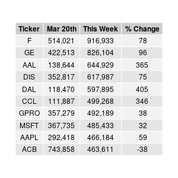
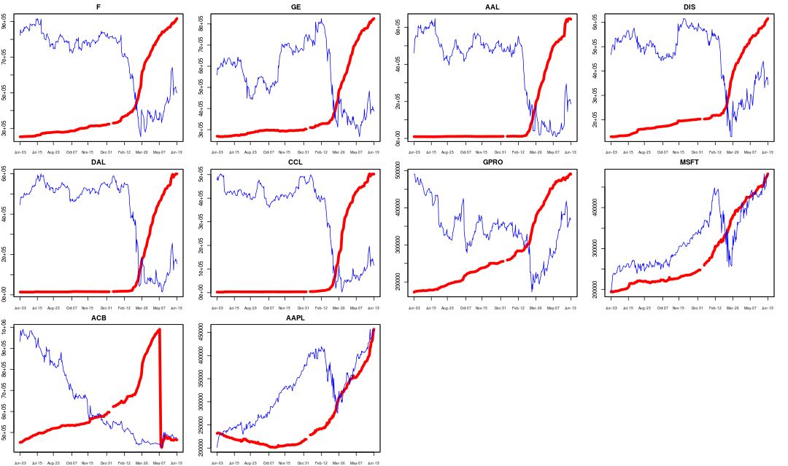
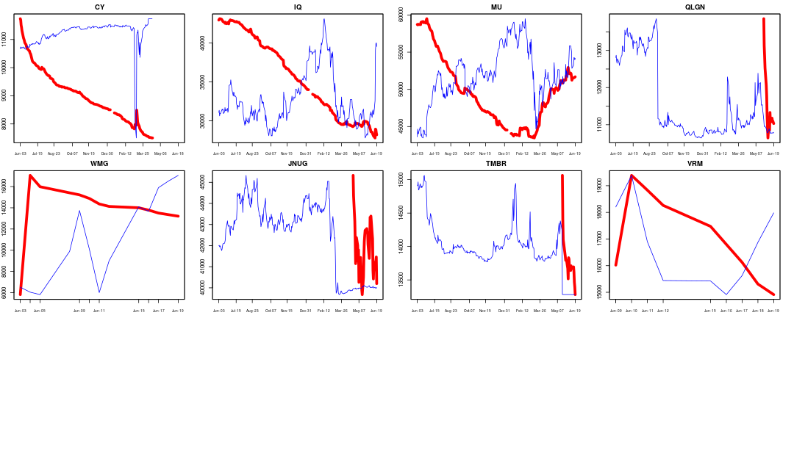

# Robinhood at a Glance

This is a preamble to full scale modeling of the Robinhood popularity data using machine learning. Before I do that, I want to 
take a glance of the current market as seen in the Robinhood community. Here I use the dataset provided in [*robintrack*](https://robintrack.net), 
which has user holdings up till Jun 20, 2020. 

[Robinhood](https://robinhood.com) is a discount broker which charges zero commission for stock trading. It has gained almost a cult following in
recent years, particularly among the millennials. Unlike other brokers, it publishes aggregate data about what stocks its
users own, and that is the *popularity data* I analyse here. 

For example, in the table below, it shows there are 904,254 stock accounts in Robinhood 
that owns shares in Ford. However, Robinhood does not publish the exact number of shares each account holds. 

Since the dataset is quite large (3.3 Gb) and belongs to *robintrack*, I do not include it here. To run my scripts, you need to download it from his site -- see __Data Sources__ below.

## Data Exploratory Analysis

I show some properties of this dataset and found some issues, see [this](Data_Exploration.md).

## Top 10 Holdings [Jun 27th, 2020]
These are the favorites of the Robinhood community. Interestingly, seven of the 10 happen to be old fashion non-technology names. An automaker makes it to the top of the list is puzzling. They surely have many bottom-fishers, thus the large interest in the two beaten-up airlines and one cruise operator (`AAL`, `DAL`, `CCL`). But there are also the big tech fans as in `MSFT`  and `AAPL`.

 

__Changes this week__ : Every stock on this list saw an increase in user holding, except `ACB` and `CCL`. 

Below I plot the popularity over time against the price since Jun 2019. The key observation here is that a surge in the accounts occured at around the last week of March, or near the market bottom -- sorry I know it's hard to read the date.  

Red line : Robinhood's popularity, or user holding. Blue line : stock price.

## Largest % increase since Mar 20
Holdings in these stocks have gone up mutiple times. I use March 20 as the base level for comparison since that's the bottom of this bear market -- so far. 

    
| Ticker    |  Company Name   | Mar 20 Holdings | Current Holdings | Change % |
| -----------|--------|---------|---------|------|
|  IVR   | Invesco Mortgage|  1,323  |  144,370 |  10,812|
| GNUS   | Genius Brands |  3,532 |   190,193  | 5,284 |
| SHIP  |Seanergy Maritime|   1,757  |   78,600 |  4,373|
|  UCO  |ProShares Ultra Crude Oil|  3,955  |  164,385 |  4,056|
|  HTZ   | Hertz|  4,970 |   163,226|  3,184|
| MFA   | MFA Financial | 5,614 |  180,614 | 3,117 |
| XSPA  |XpresSpa |   2,849  |   90,944 |  3,092|
| TOPS  | Top Ships  |    7,537 |   180,647 | 2,297 |
| VTIQ[3]  | VectoIQ (Nikola)  |       5,110  |   86,881 | 1,600 |
| USO  | U.S. Oil Fund  |   19,737  |  175,211 |  788 |

`IVR` is a mortgage REIT that almost went bankrupt.  `GNUS` is a stay-at-home stock, which caters to family with kids locked up at home.  Hertz is a travel stock that just went bankrupt, has been all over the news. `XSPA` provides spa services at airports, so it's in same category as airlines. The two oil ETFs (`USO`, `UCO`) and the two tanker stocks (`TOPS`, `SHIP`) are obvious bets on oil rebound. VTIQ, which has merged and become Nikola, is an outlier.

So, we have evidence of one prominent theme on Robinhood : big bets on oil.

## Largest decrease since Mar 20
Who is falling out of favor? 

To make sure we're not picking up the thinly traded stocks with little interest, the holding on Mar 20 must be at least 10k. 

| Ticker    |  Company Name   | Mar 20 Holdings | Current Holdings | Change % |
| -----------|--------|---------|---------|------|
|  ACB  |Aurora Cannabis|     743858 |   465437 | -37|
|  APRN  |Blue Apron|      13838 |     9159 | -33|
| WTRH   |Waitr Holdings|     20028  |   14435 | -28|
|  OPK   |OPKO Health|     44611  |   32637 | -27|
| UVXY   |ProShares Ultra VIX Futures |     14938  |   11209 | -25|
| CODX   |Co-Diagnostics|     32054  |   25410 | -21|
| CORV   |Correvio Pharma|     10290  |    8432 | -18|
| IRBT   |iRobot |     10296  |    8617 | -16|
| GUSH   |Direxion Oil Gas Bull 2X |     30439  |   27219 | -10|
| APT    |Alpha Pro Tech|    11203   |  10136 | -9.5|

These names are being shunned by the Robinhood community. Since Robinhood has been growing rapidly with hundreds of thousands of accounts added every month, these stocks have seen a drop in total holding, meaning not only new investors avoided them, existing accounts have closed out previous positions.

It's not clear there's any pattern here.

   

## Stocks held by at least 100k accounts [Jun 27th, 2020]
Just a quick scan of the most popular holdings. Notice that some of these are ETF, e.g. `VOO`, `SPY`. Interestingly, `QQQ` is not on this list.

`[1] "F"    "GE"   "AAL"  "DIS"  "DAL"  "CCL"  "GPRO" "MSFT" "AAPL" "ACB"  "NCLH" "UAL"  "BA"   "BAC"  "PLUG" "FIT" 
[17] "SNAP" "TSLA" "AMZN" "HEXO" "CGC"  "RCL"  "UBER" "SAVE" "INO"  "TWTR" "AMD"  "CRON" "BABA" "FB"   "GRPN" "MRNA"
[33] "ZNGA" "MGM"  "MRO"  "LUV"  "SBUX" "KO"   "APHA" "JBLU" "T"    "TOPS" "GNUS" "MFA"  "OGI"  "USO"  "XOM"  "UCO" 
[49] "NIO"  "HTZ"  "NKLA" "IVR"  "NFLX" "LK"   "GM"   "AMC"  "SPCE" "NOK"  "VOO"  "NVDA" "CPE"  "CTST" "NRZ"  "PLAY"
[65] "PENN" "TLRY" "DKNG" "CPRX" "SIRI" "OAS"  "SPY"  "WORK" "NKE"`

__Changes this week__ : `NKE`

-----
 
### Data Sources
Popularity data originated from Robinhood, the history of which is downloaded from *robintrack*[1]. 

Price data is from Yahoo Finance[2].

## Scripts
The main script is `robintrack.R` where the CSV files are parsed and aggregated into daily and weekly data. It calls the functions in `Fun.R` under subdirectory `utils`.

To use this script, you need to download the CSV files, a total of 8,467 of them from *robintrack* and save them in the subdirectory `robintrack_popularity_export`. 

Unlike python, you're not supposed to run this R script on the command line. The best way to use the capability here is to install `Rstudio` and run the script one block at a time.

For python folks, the R language doesn't use or need many (or any) loops :)

### Install Software
To install R, press Ctrl+Alt+T to open a terminal

    sudo apt-get update 
    sudo apt-get install r-base

### Dependencies
Code has been tested on 
* R 3.6.0
* Ubuntu 18.04 

### Contact
To ask questions or report issues, please open an issue on the [issues tracker](https://github.com/htso/Robinhood_at_a_glance/issues).

References

[1] https://robintrack.net

[2] https://finance.yahoo.com/

[3] VectoIQ has merged with Nikola and ceased to trade on NASDAQ. 

-----

The information in this repository is provided for information purposes only. It is not intended to be and does not
constitute financial advice or any other advice, is general in nature and not specific to you. Before using this
information to make an investment decision, you should seek the advice of a qualified and registered securities
professional and undertake your own due diligence. None of the information here is intended as investment advice,
as an offer or solicitation of an offer to buy or sell, or as a recommendation, endorsement, or sponsorship of any
security, Company, or fund. I am not responsible for any investment decision made by you. You are responsible for
your own investment research and investment decisions.

