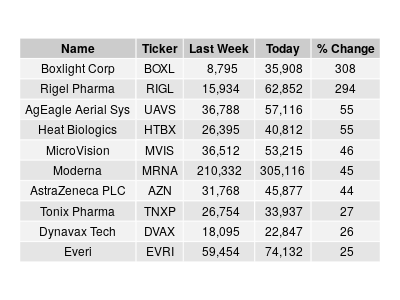
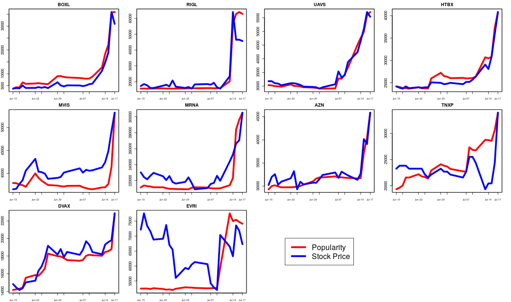
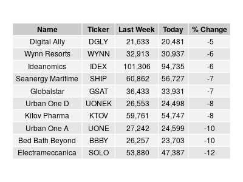
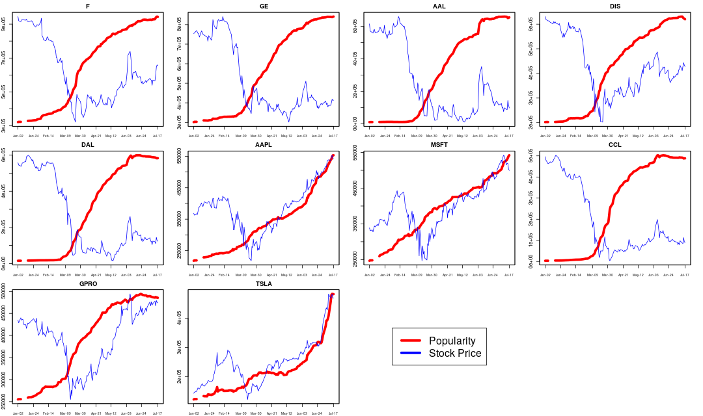

# Robinhood at a Glance
### -- July 19, 2020

This is a preamble to full scale modeling of the Robinhood popularity data using machine learning. Before that, I want to 
take a glance of the current market as seen in the Robinhood community. Here I use the dataset provided in [*robintrack*](https://robintrack.net), 
which has the most up-to-date user holdings data. 

[Robinhood](https://robinhood.com) is a discount broker which charges zero commission for stock trading. It has gained wide following in recent years, particularly among the millennials. Unlike other brokers, it publishes aggregate data about what stocks its users own, which is called a stock's *popularity*. 

Since the dataset is quite large (3.3 Gb) and belongs to *robintrack*, I do not include it here. To run my scripts, you need to download it from his site -- see __Data Sources__ below.

I plan to update every weekend with new *robintrack* data. So come back to see what's changed and what's new.

## Popularity Data
Robinhood's popularity data tells us the number of users who hold a position in a stock. It is not, however, a net number, i.e. it is not the sum of longs minus shorts. If there are two users, for example, user 1 longs 1 share, and user 2 shorts 1 share, the popularity is not 0, but 2. While it may be true that most RH traders have a long bias, one should'nt read a large popularity as a sentiment of bullishness. 

Another aspect to keep in mind is that popularity doesn't equate to exposure. A large number of RH users may only control a small number of shares in total, so that the total exposure in the RH community is actually small for a large popularity value. At the other extreme, a small number of users may own a large number of shares. In that case, the popularity would be small while the overall exposure is huge. 

Thus, there is no direct and necessary relationship between popularity and sentiment on a stock. In fact, the usefulness of this particular data point is to be evaluated and determined by a suitable ML model. On some stocks, a large popularity may be a good predictor of future return while it may have little value on others. 

## Stocks held by at least 100k accounts [July 19, 2020]
Just a quick scan of the most popular holdings. Notice that some of these are ETF, e.g. `VOO`, `SPY`. 
`"F"    "GE"   "AAL"  "DIS"  "DAL"  "AAPL" "MSFT" "CCL"  "GPRO" "TSLA" "ACB" 
"PLUG" "AMZN" "NCLH" "BAC"  "SNAP" "FIT"  "BA"   "UAL"  "MRNA" "NIO"  "HEXO"
"UBER" "BABA" "CGC"  "FB"   "RCL"  "TWTR" "AMD"  "CRON" "INO"  "ZNGA" "NFLX"
"SAVE" "KO"   "T"    "TOPS" "SBUX" "APHA" "LUV"  "MRO"  "JBLU" "MGM"  "GNUS"
"OGI"  "XOM"  "MFA"  "USO"  "SPCE" "UCO"  "HTZ"  "IVR"  "NVDA" "AMC"  "GM"  
"WKHS" "NOK"  "VOO"  "PFE"  "NRZ"  "SQ"   "PLAY" "CPRX" "SPY"  "CPE"  "WORK"
"SIRI" "TLRY" "PENN" "NKE"  "VSLR"`

## Biggest Increase Last Week [Jul 19, 2020]
These 10 stocks saw the biggest percent increase in user holdings last week. 

 

 

## Biggest Decrease Last Week [Jul 19, 2020]
Likewise, these are the biggest losers last week.

 

## Top 10 Holdings [Jul 19, 2020]
These are the favorites of the Robinhood community. 

 

## Data Exploratory Analysis

I show some properties of this dataset and found some issues, see [this](Data_Exploration.md).

-----
 
### Data Sources
Popularity data originated from Robinhood, the history of which is downloaded from *robintrack*[1]. 

Price data is from Yahoo Finance[2].

## Scripts
The main script is `robintrack.R` where the CSV files are parsed and aggregated into daily and weekly data. It calls the functions in `Fun.R` under subdirectory `utils`.

To use this script, you need to download the CSV files, a total of 8,467 of them from *robintrack* and save them in the subdirectory `robintrack_popularity_export`. 

Unlike python, you're not supposed to run this R script on the command line. The best way to use the capability here is to install `Rstudio` and run the script one block at a time.

For python folks, the R language doesn't use or need many (or any) loops :)

### Install Software
To install R, press Ctrl+Alt+T to open a terminal

    sudo apt-get update 
    sudo apt-get install r-base

### Dependencies
Code has been tested on 
* R 3.6.0
* Ubuntu 18.04 

### Contact
To ask questions or report issues, please open an issue on the [issues tracker](https://github.com/htso/Robinhood_at_a_glance/issues).

References

[1] https://robintrack.net

[2] https://finance.yahoo.com/

[3] VectoIQ has merged with Nikola and ceased to trade on NASDAQ. 

-----

The information in this repository is provided for information purposes only. It is not intended to be and does not
constitute financial advice or any other advice, is general in nature and not specific to you. Before using this
information to make an investment decision, you should seek the advice of a qualified and registered securities
professional and undertake your own due diligence. None of the information here is intended as investment advice,
as an offer or solicitation of an offer to buy or sell, or as a recommendation, endorsement, or sponsorship of any
security, Company, or fund. I am not responsible for any investment decision made by you. You are responsible for
your own investment research and investment decisions.

